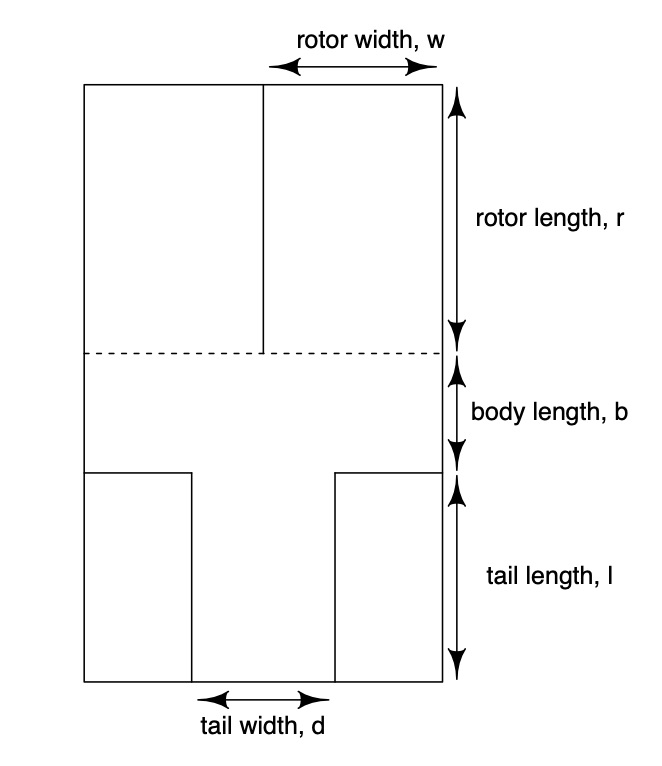

 
```{r libraries, message = F}
library(apts.doe)
library(FrF2) # for the half-normal plot and Plackett-Burman designs
library(effects) # for factorial effects plots
library(fractional) # to simplify display of Alias matrices
```

## The experiment

Video: [School children](https://tinyurl.com/uzpn7bs4)

Website: [Paper helicopter experiment](https://www.paperhelicopterexperiment.com)



We will have four factors with the following levels:
```{r factors}
w <- c(0.03, 0.09) # rotor width [0.03, 0.09]m
r <- c(0.07, 0.12) # rotor length [0.07, 0.12]m
t <- c(0.07, 0.12) # tail length [0.07, 0.12]m
d <- c(0.06, 0.12) # paper density [0.06, 0.12] kgm^-2
```

## Full factorial design

All combinations of the two levels of the four factors. Flighttime is simulated using the function `flighttime` from the `apts.doe` package (uses a loosely physics-based model - see Shen et al., 2014, JQT)

```{r factorial_design}
X <- expand.grid(w = w, r = r, t = t, d = d) # form the factorial design by taking all 16 combinations
X <- X[sample(1:16), ] # randomise the run order
y <- flighttime(w = X[, 1], r = X[, 2], t = X[, 3], d = X[, 4], theta1 = 1.9) # simulate the data
y
```

## Modelling

Set up the four columns of X as factors, and recode the levels as -1, 1

```{r recode}
X <- lapply(X, factor)
for(i in 1:4) contrasts(X[[i]]) <- contr.twolevel() # function from apts.doe to recode levels
heli <- data.frame(X, y)
```

Fit the linear model, and get the coefficients

```{r lmFF}
heli.lm <- lm(y ~ (.) ^ 4, data = heli)
coef(heli.lm)
```

Produce a half-normal plot to decide which effects are important (which estimated effects look like outliers)

```{r normalplot}
par(pty = "s", mar = c(8, 4, 1, 2))
DanielPlot(heli.lm, main = "", datax = F, half = T, autolab = F) # from FrF2
```

Produce effects plots for important main effects and interactions
```{r effectsplots}
helip.lm <- lm(y ~ (.) ^ 3, data = heli)
plot(Effect("w", helip.lm), main = "", rug = F, aspect = 1)
plot(Effect("r", helip.lm), main = "", rug = F, aspect = 1)
plot(Effect("d", helip.lm), main = "", rug = F, aspect = 1)
## Effect is from effects package

plot(Effect(c("w", "r"), helip.lm), main = "", rug = F, x.var = "w")
plot(Effect(c("w", "d"), helip.lm), main = "", rug = F, x.var = "w")
plot(Effect(c("r", "d"), helip.lm), main = "", rug = F, x.var = "r")

plot(Effect(c("w", "r", "d"), helip.lm), main = "", rug = F, x.var = "w")
```

## Half replicate fractional factorial

What happens if we only look at a half-fraction?

```{r half}
X.full <- model.matrix(y ~ (.) ^ 4, data = heli) # construct the full model matrix
## pick out the half-fraction with x1x2x3x4 = 1; equivalent to assigning x4 = x1x2x3
heli.FF1 <- heli[X.full[, 16] == 1,]
heliFF1.lm <- lm(y ~ (.) ^ 4, data = heli.FF1)
coef(heliFF1.lm) 
```

Compare the estimated coefficients with the above for the full factorial 
- e.g. betahat1(frac) = betahat1(full) + betahat234(full) 

```{r halfvFF}
A <- Amatrix(model.matrix(heliFF1.lm)[, 1:8], model.matrix(heliFF1.lm)[, 9:16])
# Amatrix is a simple function from apts.doe for calculating the alias matrix
fractional(A)
coef(heli.lm)[1:8] + A %*% coef(heli.lm)[-(1:8)]
coef(heliFF1.lm)
coef(heli.lm)
```


Pick out the other half-fraction with x1x2x3x4 = -1; equivalent to assigning x4 = -x1x2x3

```{r otherFF}
heli.FF2 <- heli[X.full[, 16] == -1,]
heliFF2.lm <- lm(y ~ (.) ^ 4, data = heli.FF2)
coef(heliFF2.lm) 
```

Compare the estimated coefficients with the above for the full factorial 
- e.g. betahat1(frac) = betahat1(full) - betahat234(full) 

```{r halfvotherFF}
A <- Amatrix(model.matrix(heliFF2.lm)[, 1:8], model.matrix(heliFF2.lm)[, 9:16])
fractional(A)
coef(heli.lm)[1:8] + A %*% coef(heli.lm)[-(1:8)]
```
## Plackett-Burman design

Now pick out the runs corresponding to a 12 run Plackett-Burman design
```{r PB}
pb12 <- pb(12, 4) # from FrF2
pb12 <- sapply(pb12, function(x) as.numeric(as.character(x)))
heli.PB <- heli[match(data.frame(t(pb12)), data.frame(t(X.full[,2:5]))), ]
heli.PB
```


Fit the model, and get the coefficients
```{r pblm}
heliPB.lm <- lm(y ~ (.) ^ 4, data = heli.PB)
coef(heliPB.lm)
```

And then the alias matrix; notice all the partial aliasing between the main effect of a factor and all the two-factor interactions not involving that factor

```{r pbA}
X.PB <- model.matrix(heliPB.lm)
A <- Amatrix(X.PB[, 1:5], X.PB[, 6:16]) 
fractional(A)
```
```{r pbcoefs}
heliPB2.lm <- lm(y ~ (.), data = heli.PB)
coef(heliPB2.lm)
coef(heli.lm)[1:5] + A %*% coef(heli.lm)[-(1:5)]
```
