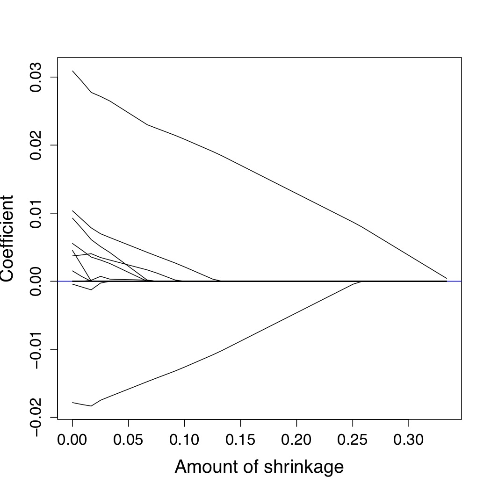
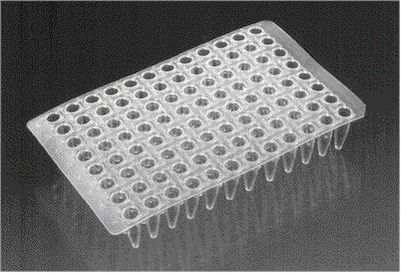
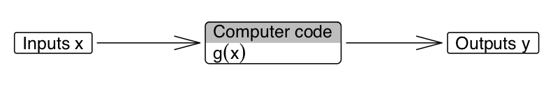
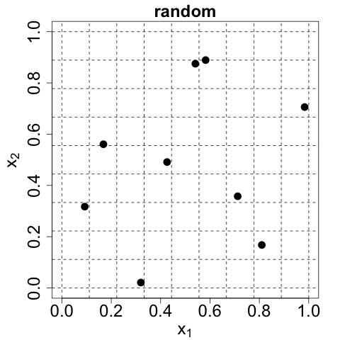
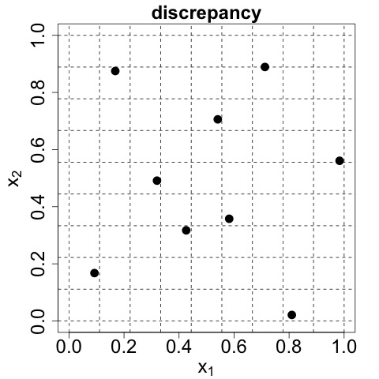
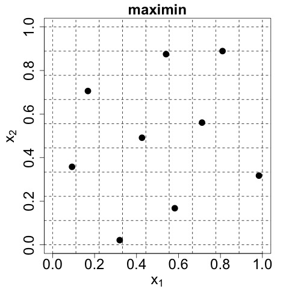

\newcommand{\bx}{\boldsymbol{x}}
\newcommand{\btheta}{\boldsymbol{\theta}}
\newcommand{\bbeta}{\boldsymbol{\beta}}
\newcommand{\bomega}{\boldsymbol{\omega}}
\newcommand{\bvarepsilon}{\boldsymbol{\varepsilon}}
\newcommand{\by}{\boldsymbol{y}}
\newcommand{\rT}{\mathrm{T}}
\newcommand{\Var}{\operatorname{Var}}
\newcommand{\bY}{\boldsymbol{Y}}
\newcommand{\beff}{\boldsymbol{f}}
\newcommand{\bphi}{\boldsymbol{\phi}}
\newcommand{\bg}{\boldsymbol{g}}
\newcommand{\bkappa}{\boldsymbol{\kappa}}
\newcommand{\be}{\boldsymbol{e}}

<style>
pre {
  font-size: 15px;
}
</style>

```{r, echo=FALSE}
options(width=80)
library(knitr)
library(xtable)
set.seed(1)
knit_hooks$set(no.main = function(before, options, envir) {
    if (before) par(mar = c(4.1, 4.1, 1.1, 1.1), pty = "s")  # smaller margin on top
})
opts_chunk$set(echo=TRUE, warning=FALSE, message=FALSE)
```

##Preliminaries

A few example designs and data sets for this module are available in the <tt>R</tt> package <tt>apts.doe</tt>, which can be installed from <tt>GitHub</tt>

```{r prelim}
library(devtools)
install_github("statsdavew/apts.doe", quiet = T)
library(apts.doe)
```

References will be provided throughout but some good general purpose texts are

  - Santner, Williams and Notz (2003). The Design and Analysis of Computer Experiments. Springer.
  - Atkinson, Donev and Tobias (2007). Optimum Experimental Design, with SAS. OUP
  - Wu and Hamada (2009). Experiments: Planning, Analysis, and Parameter Design Optimization (2nd ed.). Wiley.
  - Morris (2011). Design of Experiments: An Introduction based on Linear Models. Chapman and Hall/CRC Press.
  
These notes and other resources can be found at [https://statsdavew.github.io/apts.doe/](https://statsdavew.github.io/apts.doe/)

#Motivation and background

## Modes of data collection

 - Observational studies
 - Sample surveys
 - **Designed experiments**

## Experiments {.columns-2}

**Definition**: An experiment is a procedure whereby controllable factors, or features, of a system or process are **deliberately** varied in order to understand the impact of these changes on one or more measurable responses.

 - "prehistory": Bacon, Lind, Peirce, ... (establishing the scientific method)
 - agriculture (1920s)
 - clinical trials (1940s)
 - industry (1950s)
 - in-silico (1980s)

 <!--
 ```{r, echo = F, out.width = "75%", out.extra = 'style="display: block; margin-left: auto; margin-right: auto;"'}
 include_graphics("figures/fisher.jpg")
 ```
 -->
 
<center> 


</center>

## Role of experimentation

Why do we experiment?

 - key to the scientific method <br>
 (hypothesis -- **experiment** -- observe -- infer -- conclude)
 
 - potential to establish **causality** ...
  
 - ... and to understand/improve complex systems depending on many factors
  
 - comparison of treatments, factor screening, prediction, optimisation, ...
 
**Design of experiments**: a statistical approach to the arrangement of the operational details of the experiment (eg sample size, specific experimental conditions investigated, ...) so that the quality of the answers to be derived from the data is as high as possible.

## Simple motivating example
Consider an experiment to compare two treatments (eg drugs, diets, fertilisers). 

We have $n$ subjects (eg people, mice, plots of land), each of which can be assigned to one of the two treatments. 

A response (eg protein measurement, weight, yield) is then measured from each subject.

**Question:** How should the two treatments be assigned to the subjects to gain the most precise inference about the difference in expected response from the two treatments.

##
Assume a linear model for the response
$$
y_i = \beta_0 + \beta_1 x_i + \varepsilon_i\,,\qquad i=1,\ldots,n\,,
$$
with $\varepsilon_i\sim N(0, \sigma^2)$ independently, $\beta_0,\beta_1$ unknown parameters and 
$$
x_i = \left\{
\begin{array}{cc}
-1 & \mbox{if treatment 1 is applied to subject $i$}\,, \\
+1 & \mbox{if treatment 2 is applied to subject $i$}
\end{array}
\right.
$$
The difference in expected response between treatment 1 and 2 is
$$
E(y_i\,|\, x_i = +1) - E(y_i\,|\, x_i = -1) = \beta_0 + \beta_1 - \beta_0 + \beta_1 = 2\beta_1 
$$
So we need the most precise possible estimator of $\beta_1$

##
Both $\beta_0$ and $\beta_1$ can be estimated using least squares (or equivalently maximum likelihood). 

Writing
$$
\by = X\bbeta + \bvarepsilon\,,
$$
we obtain estimators
$$
\hat{\bbeta} = \left(X^\rT X\right)^{-1}X^\rT\by
$$
with
$$
\mbox{Var}(\hat{\bbeta}) = \left(X^\rT X\right)^{-1}\sigma^2
$$
In this simple example, we are interesting in estimating $\beta_1$, and we have
$$
\begin{split}
\mbox{Var}(\hat{\beta_1}) & = \frac{n\sigma^2}{n\sum x_i^2 - \left(\sum x_i\right)^2}\\ 
& = \frac{n\sigma^2}{n^2 - \left(\sum x_i\right)^2}
\end{split}
$$

## 
Hence, we need to pick $x_1,\ldots,x_n$ to minimise $\left(\sum x_i\right)^2 = (n_1 - n_2)^2$

  - denote as $n_1$ the number of subjects assigned to treatment 1, and  $n_2$ the number assigned to treatment 2, with $n_1+n_2 = n$
  - it is obvious that $\sum x_i = 0$ if and only if $n_1 = n_2$

Assuming $n$ is even, the "optimal design" has $n_1 = n_2 = n/2$

For $n$ odd, let $n_1 = \frac{n+1}{2}$ and $n_2 = \frac{n-1}{2}$

We can assess a designs, labelled $\xi$, via its **efficiency** relative to the optimal design $\xi^\star$:
$$
\mbox{Eff($\xi$)} = \frac{\mbox{Var}(\hat{\beta_1}\,|\,\xi^\star)}{\mbox{Var}(\hat{\beta_1}\,|\,\xi)}
$$

##
```{r motivation, fig.align='center'}
n <- 50
eff <- function(n1) 1 - ((2 * n1 - n) / n)^2
curve(eff, from = 0, to = n, ylab = "Eff", xlab = expression(n[1]))
```

## Definitions

 - **Treatment** -- entities of scientific interest to be studied in the experiment <br>
 eg varieties of crop, doses of a drug, combinations of temperature and pressure
 
 - **Unit** -- smallest subdivision of the experimental material such that two units may receive different treatments <br>
 eg plots of land, subjects in a clinical trial, samples of reagent
 
 - **Run** -- application of a treatment to a unit 
 
## Example

Fabrication of integrated circuits [see @WH2009]

 - an initial step in fabricating integrated circuits is the growth of an epitaxial layer on polished silicon wafers via chemical deposition
 
Unit

  - set of six wafers (mounted in a rotating cylinder)

Treatment

  - combination of settings of the factors
    - A : rotation method ($x_1$)
    - B : nozzle position ($x_2$)
    - C : deposition temperature ($x_3$)
    - D : deposition time ($x_4$) 
 
## A unit-treatment statistical model

$$
y_{ij} = \tau_i + \varepsilon_{ij}\,,\qquad i=1,\ldots,t;\,j=1,\ldots,n_i\,, 
$$
 where
 
 - $y_{ij}$ : measured response from the $j$th unit to which treatment $i$ has been applied
 
 - $\tau_i$ : treatment effect (expected response from application of the $i$th treatment)
 
 - $\varepsilon_{ij}$ : random deviation from the expected response [typically $\sim N(0,\sigma^2)$] 
 
 The aims of the experiment are achieved by estimating comparisons between the treatment effects, $\tau_k - \tau_l$.
 
 Experimental precision and accuracy are largely obtained through **control** and **comparison**.

## Model assumptions
Three key model assumptions are:

  - **additivity** (response = treatment effect + unit effect)
  - **constancy** of treatment effects (treatment effect does not depend on the unit to which it is applied)
  - **no interference** between units (the effect of a treatment applied to unit $j$ does not depend on the treatment applied to any other unit)

See @DPR2015 for discussion of these assumptions for factorial experiments

## Principles of experimentation
Stratification (blocking)

  - account for systematic differences between batches of experimental units by arranging them in homogeneous sets (**blocks**)
    - if the same treatment was applied to all units, within-block variation in the response would be much less than between-block
    - compare treatments within the same block and hence eliminate block effects

Replication

  - the application of each treatment to multiple experimental units
    - provides an estimate of experimental error against which to judge treatment differences
    - reduces the variance of the estimators of treatment differences

        
##
Randomisation

  - we randomise features such as the allocation of units to treatments, the order in which treatments are applied, ...
    - protects against lurking (uncontrolled) variables (model-robust) and subjectively in the allocation of treatments to units

Randomisation is perhaps the **key** principle in the design of experiments

  - it protects against model misspecification (bias), and hence allows **causality** to be established
    - a clear difference between treatments can only be an accident of the randomisation or a consequence of the treatments
  - unbiased estimation of $\tau$ and $\sigma^2$, even if the errors are not normally distributed
  - exact tests for differences between treatment effects are available [@Basu1980]
  
##
Without randomisation, unobserved confounders ($U$) can induce a dependency between  
the response ($Y$) and treatment ($T$)
```{r causal, echo = F, fig.show='hold', out.width="75%", fig.align='center'}
library(igraph)
g1 <- graph_from_literal(Y+-T+-U, Y+-U)
l <- matrix(
c(-2,0,
0, 0,
2, 0),
nrow = 3, byrow =T
)
E(g1)$lty <- c(2, 1, 1)
E(g1)$width <- 5
E(g1)$arrow.size <- 2
E(g1)$curved <- c(0, -1, 0)
V(g1)$color <- "lightblue"
V(g1)$size <- 100
V(g1)$shape <- "square"
V(g1)$label <- c("Y", "T", "U")
V(g1)$label.cex <- 2
plot(g1, layout = l, rescale = F, margin = c(1, 0, -1, 0))
```
cf @CR2000, p.35

##
With randomisation, unobserved confounders ($U$) are independent of the treatment ($T$). Marginalisation over $U$ does not induce an edge between $T$ and $Y$
```{r causalR, echo = F, fig.show='hold', out.width="75%", fig.align='center'}
g2 <- graph_from_literal(Y, T, U, Y+-U)
l <- matrix(
c(-2,0,
0, 0,
2, 0),
nrow = 3, byrow =T
)
E(g2)$width <- 5
E(g2)$arrow.size <- 2
E(g2)$curved <- -1
V(g2)$color <- "lightblue"
V(g2)$size <- 100
V(g2)$shape <- "square"
V(g2)$label <- c("Y", "T (rand)", "U")
V(g2)$label.cex <- 2
plot(g2, layout = l, rescale = F, margin = c(1, 0, -1, 0))
```
cf @CR2000, p.35

# Factorial designs

## Example revisited

Fabrication of integrated circuits [@WH2009, p155]

Treatment

  - combination of settings of the factors
    - A : rotation method ($x_1$)
    - B : nozzle position ($x_2$)
    - C : deposition temperature ($x_3$)
    - D : deposition time ($x_4$)

**Assume each factor has two-levels, coded -1 and +1**

## Treatments and a regression model

Each factor has two levels $x_k = \pm 1,\, k=1,\ldots,4$
 
A treatment is then defined as a combination of four values of $-1, +1$
    
  - eg $x_1 = -1, x_2 = -1, x_3 = +1, x_4 = -1$
  - specifies a setting of the process
    
Assume each treatment effect is determined by a regression model in the four factors, eg
$$
\tau(\bx) = \beta_0 + \sum_{i=1}^4\beta_ix_i + \sum_{j=1}^4\sum_{i>j}^4\beta_{ij}x_ix_j
$$
 
## (Two-level) Factorial design

```{r}
with(cirfab, cirfab[order(x1, x2, x3, x4), ])
```

 - treatments in standard order
 
 - $\bar{y}$ - average response from the six wafers
 
## Regression model and least squares

$$
\boldsymbol{Y} = X\boldsymbol{\beta} + \boldsymbol{\varepsilon}\,,\qquad \boldsymbol{\varepsilon}\sim N(\boldsymbol{0}, \sigma^2I)\,,\qquad 
\hat{\boldsymbol{\beta}} = \left(X^\mathrm{T}X\right)^{-1}X^\mathrm{T}\boldsymbol{Y}
$$

  - model matrix $X$ has columns corresponding to intercept, linear and cross-product terms
 
  - information matrix $X^\mathrm{T}X = nI$

 - regression coefficients are estimated by independent contrasts in the data

```{r} 
cirfab.lm <- lm(ybar ~ (.) ^ 2, data = cirfab)
coef(cirfab.lm)
```

## Main effects and interactions

Main effect of $x_k$:
$$
[\text{Avg. response when $x_k = 1$}]\, -\, [\text{Avg. response when $x_k = -1$}]
$$

Interaction between $x_j$ and $x_k$:
$$
[\text{Avg. response when $x_jx_k= 1$}]\, -\, [\text{Avg. response when $x_jx_k = -1$}]
$$

Higher-order interactions defined similarly
 
<br>
 
Assuming -1,+1 coding, there is a straightforward relationship between **factorial effects** and **regression coefficients**

 - main effect of $x_k$ is equal to $2\beta_k$
 - interaction between $x_j$ and $x_k$ is equal to $2\beta_{jk}$ 

##
Using the <tt>`effects`</tt> package:
 
```{r eval = F}
library(effects)
plot(Effect("x1", cirfab.lm), main = "", rug = F, ylim = c(13.5, 14.5), aspect = 1)
plot(Effect("x2", cirfab.lm), main = "", rug = F, ylim = c(13.5, 14.5), aspect = 1)
plot(Effect("x3", cirfab.lm), main = "", rug = F, ylim = c(13.5, 14.5), aspect = 1)
plot(Effect("x4", cirfab.lm), main = "", rug = F, ylim = c(13.5, 14.5), aspect = 1)
```
 
## Main effects

```{r fig.show='hold', out.width="45%", echo = F}
library(effects)
plot(Effect("x1", cirfab.lm), main = "", rug = F, ylim = c(13.8, 14.5))
plot(Effect("x2", cirfab.lm), main = "", rug = F, ylim = c(13.8, 14.5))
plot(Effect("x3", cirfab.lm), main = "", rug = F, ylim = c(13.8, 14.5))
plot(Effect("x4", cirfab.lm), main = "", rug = F, ylim = c(13.8, 14.5))
```

## Interactions
```{r, echo = T}
plot(Effect(c("x3", "x4"), cirfab.lm), main = "", rug = F, ylim = c(13.5, 15), 
     x.var = "x4")
```

## Orthogonality
$X^\mathrm{T}X = nI \Rightarrow \hat{\boldsymbol{\beta}}$ are independently normally distributed with equal variance 
 
Hence, we can treat the identification of important effects (ie large $\beta$) as an outlier identification problem
 
 - plot (absolute) ordered factorial effects against (absolute) quantiles from a standard normal
 - outlying effects are identified as important
 
 @Cuthbert1959
 
##
Using the <tt>`FrF2`</tt> package
```{r, fig.show='hold', out.width = "100%"}
library(FrF2)
par(pty = "s", mar = c(8, 4, 1, 2))
DanielPlot(cirfab.lm, main = "", datax = F, half = T)
```

## Replication
An unreplicated factorial design provides no model-independent estimate of $\sigma^2$ [@GT2012]

  - any unsaturated model does provide an estimate, but it may be biased by ignored (significant) model terms
  - this is one reason why graphical (or associated) analysis methods are popular

Replication also increases the power of the design

  - common to replicate a centre point
  - allows a portmanteau test of curvature
  - allows unbiased estimation of $\sigma^2$
      
## Principles of factorial experimentation
Effect sparsity

  - the number of important effects in a factorial experiment is small relative to the total number of effects investigated [cf @BM1986]

Effect hierarchy

  - lower-order effects are more likely to be important than higher-order effects
  - effects of the same order are equally likely to be important

Effect heredity

  - interactions where at least one parent main effect is important are more likely to be important themselves

@WH2009, pp.172--172

# Regular fractional factorial designs

## Choosing subsets of treatments
Factorial designs can require a large number of runs for only a moderate number of factors ($2^5 = 32$)

Resource constraints (eg cost) may mean not all $2^m$ combinations can be run

Lots of degrees of freedom are devoted to estimating higher-order interactions

  - eg in a $2^5$ experiment, 16 degrees of freedom are used to estimate three-factor and higher-order interactions
  - principles of effect hierarchy and sparsity suggest may be wasteful

Need to trade-off **what you want to estimate** against the **number of runs** you can afford
 

## Example
Production of bacteriocin [@Morris2011, p231]

 - bacteriocin is a natural food preservative frown from bacteria

Unit

  - a single bio-reaction

Treatment: combination of settings of the factors
       
  - A: amount of glucose ($x_1$)
  - B: initial inoculum size ($x_2$)
  - C: level of aeration ($x_3$)
  - D: temperature ($x_4$)
  - E: amount of sodium ($x_5$)

Assume each factor has two-levels, coded -1 and +1
  
 
##
Find an $n=8$ run design using <tt>FrF2</tt>

```{r bact}
bact.design <- FrF2(8, 5, factor.names = paste0("x", 1:5), 
     generators = list(c(1, 3), c(2, 3)), randomize = F, alias.info = 3)
bact.design
```

 - $8$ = $32/4$ = $2^5/2^2$ = $2^{5-2}$
 - we need a principled way of choosing one-quarter of the runs from the factorial design that leads to clarity in the analysis

## 
Assuming the number of runs is a power of two, $n = 2^{k-q}$, we can construct $2^{k-q} -1$ orthogonal vectors (with inner product zero), spanned by $k-q = \log_2(n)$ vectors

  - construct the full factorial design for $k-q$ factors
  - assign the remaining $q$ factors to interaction columns

```{r bact2}
model.matrix(~ (x1 + x2 + x3) ^ 3, bact.design[, 1:3])[, ]
```  

## Aliasing scheme
The design has been deliberately chosen so that 

  - $x_4 = x_1x_3$
  - $x_5 = x_2x_3$

[$x_1x_2$ is shorthand for the Hadamard (Schur or entry wise) product of two vectors, $x_1\circ x_2$]

What other consequences are there?

  - $x_4x_5 = x_1x_3x_2x_3 = x_1x_2x_3^2$
  - the product of any column with itself is the constant column (the identity)
  - hence, $x_4x_5 = x_1x_2$

##
Now we can obtain the **defining relation** $\ldots$
  
  - $I = x_1x_3x_4 = x_2x_3x_5 = x_1x_2x_4x_5$
  
$\ldots$ and the complete aliasing scheme

  - $x_1 = x_3x_4 = x_1x_2x_3x_5 = x_2x_4x_5$
  - $x_2 = x_1x_2x_3x_4 = x_3x_5 = x_1x_4x_5$
  - $x_3 = x_1x_4 = x_2x_5 = x_1x_2x_3x_4x_5$
  - $x_4 = x_1x_3 = x_2x_3x_4x_5 = x_1x_2x_5$
  - $x_5 = x_1x_3x_4x_5 = x_2x_3 = x_1x_2x_4$
  - $x_1x_2 = x_2x_3x_4 = x_1x_3x_5 = x_4x_5$
  - $x_1x_5 = x_3x_4x_5 = x_1x_2x_3 = x_2x_4$

##
<tt>`FrF2`</tt> will summarise the aliasing amongst main effects and two- and three-factor interactions.

```{r bact3}
design.info(bact.design)$aliased 
```  

## The alias matrix

What is the consequence of this aliasing?

If more than one effect in each alias string is non-zero, the least squares estimators will be biased

  - assumed model $\bY = X_1\bbeta_1 + \bvarepsilon$
  - true model $\bY = X_1\bbeta_1 + X_2\bbeta_2 + \bvarepsilon$
  
  $$
  \begin{split}
  E\left(\hat{\bbeta}_1\right) & = \left(X_1^\mathrm{T}X_1\right)^{-1}X^\mathrm{T}_1E(\bY) \\
  & = \left(X^\rT_1X_1\right)^{-1}X_1^\rT\left(X_1\bbeta_1 + X_2\bbeta_2\right) \\
  & = \beta_1 + \left(X_1^\rT X_1\right)^{-1}X_1^\rT X_2\bbeta_2 \\
  & = \bbeta_1 + A\bbeta_2\\
  \end{split}
  $$
  

$A$ is the alias matrix

  - if the columns of $X_1$ and $X_2$ are not orthogonal, $\hat{\bbeta}_1$ is biased
    
##
For the $2^{5-2}$ example:

  - $X_1$ is an $8\times 6$ matrix with columns for the intercept and five linear terms ("main effects")
  - $X_2$ is an $8\times 10$ matrix with columns for the 10 product terms ("two-factor interactions")

$$
A = \left(
\begin{array}{cccccccccc}
0 & 0 & 0 & 0 & 0 & 0 & 0 & 0 & 0 & 0 \\
0 & 0 & 0 & 0 & 0 & 0 & 0 & 1 & 0 & 0 \\
0 & 0 & 0 & 0 & 0 & 0 & 0 & 0 & 1 & 0 \\
0 & 0 & 1 & 0 & 0 & 0 & 0 & 0 & 0 & 0 \\
0 & 1 & 0 & 0 & 0 & 0 & 0 & 0 & 0 & 0 \\
0 & 0 & 0 & 0 & 1 & 0 & 0 & 0 & 0 & 0
\end{array}
\right)
$$
For a regular design, the matrix $A$ will only have entries 0, $\pm 1$ (no aliasing or complete aliasing) 

##
The **transpose** of the alias matrix is provided by the <tt>`alias`</tt> function.
```{R alias}
ff.alias <- alias(y ~ (.)^2, data = data.frame(bact.design, y = vector(length = 8)))
ff.alias$Complete
```

## The role of fractional factorial designs in a sequential strategy
Typically, in a first experiment, fractional factorial designs are used in screening

  - investigate which of many factors have a substantive effect on the response
  - main effects and two-factor interactions
  - centre points to check for curvature

At second and later stages, augment the design

  - to resolve ambiguities due to the aliasing of factorial effects ("break the alias strings")
  - to allow estimation of curvature and prediction from a more complex model

# $D$-optimality and non-regular designs

## Introduction
Regular fractional factorial designs have the number of runs equal to a power of the number of levels

  - eg $2^{5-2}$, $3^{3-1}\times 2$
  - this inflexibility in run sizes can be a problem in practical experiments

Non-regular designs can have any number of runs (usually with $n>p$, the number of parameters to be estimated)

Often the clarity provided by a regular design is lost

  - no defining relation or straightforward aliasing scheme
  - partial aliasing and fractional entries in $A$
      
One approach to finding non-regular designs is via a design optimality criterion
      
## $D$-optimality
Notation: let $\xi = [\bx_1,\ldots,\bx_n]$ denote a design (choice of treatments and their replications)

Assuming the model $\bY = X\bbeta + \bvarepsilon$, with $\bvarepsilon\sim N(0, \sigma^2I_n)$, a **$D$-optimal** design maximises
$$
\phi(\xi) = \mathrm{det}\left(X^\rT X\right)
$$

That is, a $D$-optimal design maximises the determinant of the (expected) Fisher information matrix
    
  - equivalent to minimising the volume of the joint confidence ellipsoid for $\bbeta$

Also useful to define a Bayesian version, with $R$ a prior precision matrix
$$
\phi_B(\xi) = \mathrm{det}\left(X^\rT X + R\right)
$$
(See later)
  
## Comments
$D$-optimal designs are model dependent

  - if the model (ie the columns of $X$) changes, the optimal design may change
  - model-robust design is an active area of research

$D$-optimality promotes orthogonality in the $X$ matrix
    
  - if there are sufficient runs, the $D$-optimal design will usually be orthogonal
  - for particular models and choices of $n$, regular fractional factorial designs are $D$-optimal

There are many other optimality criteria, tailored to other experimental goals

  - prediction, model discrimination, space-filling, ...
    
## Example: Plackett-Burman design
$k=11$ factors in $n=12$ runs, first-order (main effects) model [@PB1946]

A particular $D$-optimal design is the following orthogonal array

Using the <tt>`pb`</tt> function in the <tt>`FrF2`</tt> package:  
```{R pb}
pb.design <- pb(12, factor.names = paste0("x", 1:11))
pb.design
```  

##
This 12-run PB design is probably the most studied non-regular design
  
  - orthogonal columns
  - complex aliasing between main effects and two-factor interactions

```{R pbalias}
pb.alias <- alias(y ~ (.)^2, data = data.frame(pb.design, y = vector(length = 12)))
head(pb.alias$Complete, n = 15)
```

## Example: supersaturated design
Screening designs with fewer runs than factors [see @WL2017]
    
  - can't use ordinary least squares/maximum likelihood as $X$ does not have full column rank
  - Bayesian $D$-optimality with $R = [0\,|\, \tau I_m]$

Supersaturated experiment used by GlaxoSmithKline in the development of a new oncology drug

  - $k=16$ factors: e.g. temperature, solvent amount, reaction time
  - $n=10$ runs
  - Bayesian $D$-optimal design with $\tau = 0.2$
    
##
```{r ssd}
ssd
```

##
Partial aliasing between main effects

Heatmap of column correlations:
```{r ssdcor, out.width="75%", fig.align='center'}
library(fields)
par(mar=c(8,2,0,0))
image.plot(1:16,1:16, cor(ssd), zlim = c(-1, 1), xlab = "Factors", 
           ylab = "", asp = 1, axes = F)
axis(1, at = seq(2, 16, by = 2), line = .5)
axis(2, at = seq(2, 16, by = 2), line = -5)
```

##
Analysis via regularised (shrinkage) methods (eg lasso, Dantzig selector; see APTS High Dimensional Statistics)

  - small coefficients shrunk to zero
  
```{r ssdshrink, echo = F, out.width="50%", fig.align='center'}

``` 

#Bayesian optimal design

##Introduction
Now consider a more general class of models (cf preliminary material).

Let $\by = (y_1,\ldots,y_n)^\rT$ be iid observations from a distribution with density/mass function $\pi(y_i\,;\,\btheta,\bx_i)$

  - $\btheta$ is a $q-$vector of unknown parameters
  - $\bx_i =(x_{1i},\ldots,x_{ki})^\rT$ is a vector of values of $k$ controllable variables.

The (expected) information matrix
$$
M(\btheta) = E_y\left[-\frac{\partial^2l(\btheta)}{\partial\btheta\partial\btheta^\rT}\right]
$$
is an important quantity for design, where $l(\btheta) = \sum_{i=1}^n\log\pi(y_i;\,\btheta,\bx_i)$ (the log-likelihood).

  - $M(\btheta)$ is the (asymptotic) precision for the maximum likelihood estimators $\hat{\btheta}$.
  - $M(\btheta)$ is also an asymptotic approximation to the posterior precision for $\btheta$ in a Bayesian analysis.

## Pharmacokinetics
**Example 1**: Compartmental model
$$
y_i \sim N\left(c(\btheta)\mu(\btheta;\,x_i), \sigma^2\nu(\btheta;\,x_i)\right)\,,\quad x_i\in[0,24]\,,
$$
with 
$$
\mu(\btheta;\,x) = \exp(-\theta_1x)-exp(-\theta_2x)\,,\quad c(\btheta) = \frac{400\theta_2}{\theta_3(\theta_2-\theta_1)}\,,\quad \nu(\btheta;\,x) = 1 + \frac{\tau^2}{\sigma^2}c(\btheta)^2\mu(\btheta;\,x)\,,
$$
for $\theta_1, \theta_2, \theta_3, \tau^2, \sigma^2>0$.

**Prior distributions** (for later use):

  - $\log\theta_i\sim N(m_i, 0.05)$, with $m_1 = \log 0.1, m_2 = 0, m_3 = \log 20$

@RDTP2014

##
```{R compex, out.width = '65%', fig.align = 'center'}
comp <- function(x, theta, D = 400) {
	mu <- exp(-theta[1] * x) - exp(-theta[2] * x)
	c <- (D / theta[3]) * (theta[2]) / (theta[2] - theta[1])
	c * mu }
theta <- c(.1, 1, 20)
M <- 100
par(mar = c(6, 4, 0, 1) + .1)
lapply(1:M, function(l) {
  thetat <- rlnorm(3,log(theta),rep(0.05,3))
  curve(comp(x, theta = thetat), from = 0, to = 24, ylab = "Expected concentration", 
        xlab = "Time", ylim = c(0, 20), xlim = c(0, 24), add = l!=1) })
```

##Crystallography
**Example 2**: multi-factor experiments to build (hierarchical) logistic regression models for pharmaceutical salt formation

Four controllable variables:

  - rate of agitation during mixing ($x_1$)
  - volume of composition ($x_2$)
  - temperature ($x_3$)
  - evaporation rate ($x_4$)
  
<center> 

</center>

##
For the $j$th observation in the $i$th group $(i=1,\ldots,g;\, j=1,\ldots,n_g)$:
$$
y_{ij} \sim \mbox{Bernoulli}\left(\rho(\bx_{ij})\right)
$$
with
$$
\log\left(\frac{\rho(\bx_{ij})}{1-\rho(\bx_{ij})}\right) = \left(\beta_0 + \omega_{i0}\right) + \sum_{r=1}^k\left(\beta_r + \omega_{ir}x_{ijr}\right)\,,
$$
where $x_{ijr}$ is the value taken by the $r$th variable.

  - $\bbeta = (\beta_0,\beta_1,\ldots,\beta_{q-1})^\rT$ are unknown parameters of interest
  - $\bomega_i = (\omega_{i0}, \omega_{i1}, \ldots, \omega_{iq-1})^\rT$ are group specific parameters for the $i$th group

**Prior distributions** (for later use):

  - $\beta_0 \sim U(-3,3)$, $\beta_1 \sim U(4, 10)$, $\beta_2 \sim U(5, 11)$, $\beta_3 \sim U(-6, 0)$, $\beta_4 \sim U(-2.5, 3.5)$
  1.  standard logistic regression - $\omega_{ir} = 0$ 
  2.  hierarchical logistic regression - $\omega_{ir} \sim U(-s_r, +s_r)$. with $s_{r}>0$ following a triangular distribution 
  
##Classical optimal designs
Many Frequentist criteria for finding optimal designs for both linear and nonlinear models optimise a function of the information matrix; see @ADT2007, ch.10

  - we have already seen $D$-optimality
 
Let $\xi = (\bx_1,\ldots,\bx_n)^\rT$ denote a design, and set $M(\xi;\,\btheta) = M(\btheta)$ to explicitly acknowledge the dependence of the information matrix on the design

  - **$D$-optimality**: maximise $\phi_D(\xi) = \mbox{det}\, M(\xi;\,\btheta)$
  - **$A$-optimality**: minimise $\phi_A(\xi) = \mbox{trace}\, M(\xi;\,\btheta)^{-1}$
  - **$G$-optimality**: minimise $\phi_G(\xi) = \max_\bx \mbox{Var}(\hat{y}(\bx))$
    - where $\hat{y}(x)$ is the predicted response at $\bx$ and the (asymptotic) prediction variance is a function of $M(\xi;\,\btheta)$
  - **$V$- (or $I$-) optimality** - minimise $\phi_V(\xi) = \int_\mathcal{X} \mbox{Var}\left(\hat{y}(\bx)\right)\,\mathrm{d}\bx$

##Optimal design for nonlinear models
For most nonlinear models, $M(\xi;\,\btheta)$ will be a function of the unknown parameters $\btheta$ (unlike for the linear model, where $M(\xi;\,\bbeta) = X^\rT X$)

This leads to a "chicken and egg" situation

  - if you can tell me the values of the unknown parameters, I can give you an optimal design
  - but if you knew the value of $\btheta$, you probably wouldn't need to perform the experiment!

For some models/experiments, the quality of a design may change a lot with the value of $\btheta$

##A simple example
```{r simplelogistic, fig.align='center'}
rho <- function(x, beta0 = 0, beta1 = 1) {
  eta <- beta0 + beta1 * x
  1 / (1 + exp(-eta))
}
par(mar = c(8, 4, 1, 2) + 0.1)
curve(rho, from = -5, to = 5, ylab = expression(rho), xlab = expression(italic(x)), cex.lab = 1.5, 
      cex.axis = 1.5, ylim = c(0, 1), lwd = 2)
```

##
For simple logistic regression, the information matrix has the form
$$
M(\xi;\,\bbeta) = X^\rT W X\,,
$$
with $X$ the $n\times 2$ model matrix and $W = \mbox{diag}\left\{\rho(x_i)[1-\rho(x_i)]\right\}$

**For example** with $n=2$, $\xi = (-1, 1)$, $\beta_0=0$ and $\beta_1 = 1$
$$
M(\xi;\,\bbeta) = 
\left(
\begin{array}{cc}
1 & 1 \\
-1 & 1
\end{array}
\right)
\left(
\begin{array}{cc}
0.2 & 0 \\
0 & 0.2
\end{array}
\right)
\left(
\begin{array}{cc}
1 & -1 \\
1 & 1
\end{array}
\right)
$$
```{r simplelogisticinfo}
Minfo <- function(xi, beta0 = 0, beta1 = 1) {
  X <- cbind(c(1, 1), xi)
  v <- function(x) rho(x, beta0, beta1) * (1 - rho(x, beta0, beta1))
  W <- diag(c(v(xi[1]), v(xi[2])))
  t(X) %*% W %*% X
}
Dcrit <- function(xi, beta0 = 0, beta1 = 1) {
  d <- det(Minfo(xi, beta0, beta1))
  ifelse(is.nan(d), -Inf, d)
}
```

##
**Locally $D$-optimal designs**

$\beta_0 = 0, \beta_1 = 1$

```{r simplelogisticdesign1}
dopt <- optim(par = c(-1, 1), Dcrit, control = list(fnscale = -1))
xi.opt1 <- dopt$par
xi.opt1
```

```{r simplogplot1, fig.align='center', echo = F}
plot.localopt <- function(xi, b0, b1) {
  par(mar = c(8, 4, 1, 2) + 0.1)
  curve(rho(x, beta0 = b0, beta1 = b1), from = -5, to = 5, ylab = expression(rho), xlab = expression(italic(x)), cex.lab = 1.5, 
      cex.axis = 1.5, ylim = c(0, 1), lwd = 2)
  points(c(xi[1], xi[2]), c(-0.02, -0.02), pch = 16, cex = 2, col = "darkblue")
  lines(c(xi[1], xi[1]), c(-0.02, rho(xi[1], beta0 = b0, beta1 = b1)), lty = 2, lwd = 2)
  lines(c(xi[2], xi[2]), c(-0.02, rho(xi[2], beta0 = b0, beta1 = b1)), lty = 2, lwd = 2)
  lines(c(-5, xi[1]), c(rho(xi[1], beta0 = b0, beta1 = b1), rho(xi[1], beta0 = b0, beta1 = b1)),lty = 2, lwd = 2)
  lines(c(-5, xi[2]), c(rho(xi[2], beta0 = b0, beta1 = b1), rho(xi[2], beta0 = b0, beta1 = b1)), lty = 2, lwd = 2)
}
plot.localopt(xi.opt1, 0, 1)
```

##
**Locally $D$-optimal designs**

$\beta_0 = 0, \beta_1 = 2$

```{r simplelogisticdesign2}
dopt <- optim(par = c(-1, 1), Dcrit, control = list(fnscale = -1), beta1 = 2)
xi.opt2 <- dopt$par
xi.opt2
```

```{r simplogplot2, fig.align='center', echo = F}
plot.localopt(xi.opt2, 0, 2)
```

##
**Locally $D$-optimal designs**

$\beta_0 = 0, \beta_1 = 0.5$

```{r simplelogisticdesign.5}
dopt <- optim(par = c(-1, 1), Dcrit, control = list(fnscale = -1), beta1 = .5)
xi.opt3 <- dopt$par
xi.opt3
```

```{r simplogplot3, fig.align='center', echo = F}
plot.localopt(xi.opt3, 0, .5)
```

##
**Getting $\beta_1$ wrong**: design for $\beta_1 = .5$ when actually $\beta_1 = 2$

$D$-efficiency
```{r evald}
(Dcrit(xi.opt3, beta1 = 2) / Dcrit(xi.opt2, beta1 = 2)) ^ (1 / 2)
```

```{r simplelogwrong, fig.align='center', echo = F}
 par(mar = c(8, 4, 1, 2) + 0.1)
  curve(rho(x, beta0 = 0, beta1 = 2), from = -5, to = 5, ylab = expression(rho), xlab = expression(italic(x)), cex.lab = 1.5, 
      cex.axis = 1.5, ylim = c(0, 1), lwd = 2)
  xi <- xi.opt2
  points(c(xi[1], xi[2]), c(-0.02, -0.02), pch = 16, cex = 2, col = "darkblue")
  lines(c(xi[1], xi[1]), c(-0.02, rho(xi[1], beta0 = 0, beta1 = 2)), lty = 2, lwd = 2)
  lines(c(xi[2], xi[2]), c(-0.02, rho(xi[2], beta0 = 0, beta1 = 2)), lty = 2, lwd = 2)
  lines(c(-5, xi[1]), c(rho(xi[1], beta0 = 0, beta1 = 2), rho(xi[1], beta0 = 0, beta1 = 2)),lty = 2, lwd = 2)
  lines(c(-5, xi[2]), c(rho(xi[2], beta0 = 0, beta1 = 2), rho(xi[2], beta0 = 0, beta1 = 2)), lty = 2, lwd = 2)
  xi <- xi.opt3
  points(c(xi[1], xi[2]), c(-0.02, -0.02), pch = 16, cex = 2, col = "darkred")
  lines(c(xi[1], xi[1]), c(-0.02, rho(xi[1], beta0 = 0, beta1 = 2)), lty = 2, lwd = 2)
  lines(c(xi[2], xi[2]), c(-0.02, rho(xi[2], beta0 = 0, beta1 = 2)), lty = 2, lwd = 2)
  lines(c(-5, xi[1]), c(rho(xi[1], beta0 = 0, beta1 = 2), rho(xi[1], beta0 = 0, beta1 = 2)),lty = 2, lwd = 2)
  lines(c(-5, xi[2]), c(rho(xi[2], beta0 = 0, beta1 = 2), rho(xi[2], beta0 = 0, beta1 = 2)), lty = 2, lwd = 2)
```

##
Use of the "wrong" design can lead to uninformative experiments (with "small" information matrices)

For the logistic regression example, the drop in efficiency is closely related to the phenomenon of separation [see @Firth1993]

Motivates the need for designs which are robust to the values of the model parameters

  - maximin designs (focus on worst case performance)
  - **Bayesian designs**
  
## Bayesian optimal design

**Decision-theoretic** design starts with a utility function $u(\xi,\by,\btheta)$ that defines the usefulness of a design for a particular purpose, given data $\by$ and parameters $\btheta$

Common choices of utility function include

  - negative squared error loss
  $$u(\xi, \by, \btheta) = -\left[\btheta - E(\btheta\,|\,\by)\right]^2$$
    - negative squared difference between $\btheta$ and the posterior mean 
  
  - surprisal or self information
  $$
  \begin{split}
  u(\xi, \by, \btheta) & = \log \pi(\btheta\,|\,\by,\xi) - \log \pi(\btheta) \\
  & = \log \pi(\by\,|\,\btheta,\xi) - \log \pi(\by\,|\,\xi)
  \end{split}
  $$
    - difference between log posterior and log prior densities, or between the log-likelihood and the log-evidence
  
## 
A priori (before the experiment), we do not know $\by$ or $\btheta$ (we will never **know** $\btheta$)

So, we take the expectation of the utility function with respect to the joint distribution of $\by,\btheta$

$$
\begin{split}
U(\xi) & = E_{\by,\btheta\,|\,\xi}\left[u(\xi,\by,\btheta)\right]\\
& = \int u(\xi,\by,\btheta)\pi(\by,\btheta\,|\,\xi)\,\mathrm{d}\btheta\,\mathrm{d}\by \\
& = \int u(\xi, \by, \btheta)\pi(\btheta\,|\,\by,\xi)\pi(\by\,|\,\xi)\,\mathrm{d}\btheta\,\mathrm{d}\by \\
& = \int u(\xi, \by, \btheta)\pi(\by\,|\,\btheta,\xi)\pi(\btheta\,|\,\xi)\,\mathrm{d}\btheta\,\mathrm{d}\by
\end{split}
$$
The equivalence of the third and fourth equations follows from Bayes theorem

  - the third equation more clearly shows the dependence on the posterior distribution
  - the fourth equation is often more useful for calculations and computation

See @CV1995

##
Surprisal
$$
\begin{split}
U(\xi) & = \int \log \frac{\pi(\btheta\,|\,\by,\xi)}{\pi(\btheta)}\pi(\by,\btheta\,|\,\xi)\,\mathrm{d}\btheta\,\mathrm{d}\by \\
& = \int \log \frac{\pi(\by\,|\,\btheta,\xi)}{\pi(\by\,|\,\xi)}\pi(\by,\btheta\,|\,\xi)\,\mathrm{d}\btheta\,\mathrm{d}\by
\end{split}
$$
  - the **expected Shannon information gain (SIG)** or expected Kullback-Liebler divergence between prior and posterior densities

Negative squared error loss
$$
\begin{split}
U(\xi) & = - \int \left[\btheta - E(\btheta\,|\,\by)\right]^2\pi(\by,\btheta\,|\,\xi)\,\mathrm{d}\btheta\,\mathrm{d}\by \\
& = - \int \mbox{tr}\left\{\mbox{Var}(\btheta\,|\,\by,\xi)\pi(\by\,|\,\xi)\right\}\,\mathrm{d}\by
\end{split}
$$
  - the **expected negative squared error loss (NSEL)**


## Challenges
In general, Bayesian design is easy in principle but hard in practice

  1. For most nonlinear models, the **expected utility will be intractable** and involves high-dimensional integrals with respect to $\by$
    - often, obtaining the utility function itself requires the solution of intractable integrals (cf both ESIG and NSEL)
    - numerical or analytical approximation is required [eg @RDMP2016]
  
  2. A **high-dimensional optimisation problem** results for multi-factor experiments with many design points
  
## Asymptotic approximations

For large $n$, the inverse information matrix $M(\xi;\,\btheta)$ is an asymptotic approximation to the posterior variance-covariance matrix

Using this approximation, we can define Bayesian analogues of classical optimality criteria

$D$-optimality: maximise
$$
U_D(\xi) = \int \log\mbox{det} M(\xi;\,\btheta)\pi(\btheta)\,\mathrm{d}\btheta
$$

  - approximation to ESIG
  
$A$-optimality: maximise
$$
U_A(\xi) = - \int \mbox{tr} M^{-1}(\xi;\,\btheta)\pi(\btheta)\,\mathrm{d}\btheta
$$

  - approximation to NSEL
  
##
These integrals, with respect to $\btheta$, are lower dimensional and more amenable to deterministic (quadrature) approximation, eg @GJS2009

The <tt>acebayes</tt> package provides functions for constructing approximations to expected utilities

  - default is to use quadrature to approximate the Bayesian $D$-optimality objective function

```{r acebayesglmutil}
library(acebayes)
prior <- list(support = matrix(c(0, 0, .5, 2), nrow = 2))
logreg.util <- utilityglm(formula = ~ x, family = binomial, prior = prior)$utility
BDcrit <- function(xi) logreg.util(data.frame(x = xi))
bdopt <- optim(par = c(-1, 1), BDcrit, control = list(fnscale = -1))
bdopt$par
```

```{r bayesdoptplot, echo = F, out.width='50%', fig.align = 'center'}
 par(mar = c(8, 4, 1, 2) + 0.1)
  curve(rho(x, beta0 = 0, beta1 = .5), from = -5, to = 5, ylab = expression(rho), xlab = expression(italic(x)), cex.lab = 1.5, 
      cex.axis = 1.5, ylim = c(0, 1), lwd = 2)
  curve(rho(x, beta0 = 0, beta1 = 2), lty = 3, from = -5, to = 5, ylab = expression(rho), xlab = expression(italic(x)), cex.lab = 1.5, 
      cex.axis = 1.5, ylim = c(0, 1), lwd = 2, add = T)
  xi <- xi.opt2
  points(c(xi[1], xi[2]), c(-0.02, -0.02), pch = 16, cex = 2, col = "darkblue")
  lines(c(xi[1], xi[1]), c(-0.02, rho(xi[1], beta0 = 0, beta1 = 2)), lty = 2, lwd = 2)
  lines(c(xi[2], xi[2]), c(-0.02, rho(xi[2], beta0 = 0, beta1 = 2)), lty = 2, lwd = 2)
  lines(c(-5, xi[1]), c(rho(xi[1], beta0 = 0, beta1 = 2), rho(xi[1], beta0 = 0, beta1 = 2)),lty = 2, lwd = 2)
  lines(c(-5, xi[2]), c(rho(xi[2], beta0 = 0, beta1 = 2), rho(xi[2], beta0 = 0, beta1 = 2)), lty = 2, lwd = 2)
  xi <- xi.opt3
  points(c(xi[1], xi[2]), c(-0.02, -0.02), pch = 16, cex = 2, col = "darkred")
  lines(c(xi[1], xi[1]), c(-0.02, rho(xi[1], beta0 = 0, beta1 = .5)), lty = 2, lwd = 2)
  lines(c(xi[2], xi[2]), c(-0.02, rho(xi[2], beta0 = 0, beta1 = .5)), lty = 2, lwd = 2)
  lines(c(-5, xi[1]), c(rho(xi[1], beta0 = 0, beta1 = .5), rho(xi[1], beta0 = 0, beta1 = .5)),lty = 2, lwd = 2)
  lines(c(-5, xi[2]), c(rho(xi[2], beta0 = 0, beta1 = .5), rho(xi[2], beta0 = 0, beta1 = .5)), lty = 2, lwd = 2)
  xi <- bdopt$par
  points(c(xi[1], xi[2]), c(-0.02, -0.02), pch = 16, cex = 2, col = "gray")
```

## Monte Carlo approximation
As an alternative to analytical approximations, Monte Carlo approximation to the expected utility is simple to implement and intuitively appealing

$$
\tilde{U}(\xi) = \sum_{i=1}^B\tilde{u}(\xi, \by_i, \btheta_i)
$$
where 

  - $\left\{\btheta_h, \by_h\right\}_{h=1}^B$ is a random sample from $\pi(\btheta,\by\,|\,\xi)$
  - $\tilde{u}(\xi,\by,\btheta)$ is, where necessary, an approximation to the utility function (often, nested Monte Carlo is required)

How to construct the approximation $\tilde{u}(\xi,\by,\btheta)$ is an active area of research, eg @OMD2018, @BMELT2018

## Optimisation
Find an optimal design using Monte Carlo:  
```{r glmMCutil}
priorMC <- function(B) cbind(rep(0, B), runif(n = B, min = .5, max = 2))
logreg.utilSIG <- utilityglm(formula = ~ x, family = binomial, prior = priorMC, criterion = "SIG")$utility
BDcritSIG <- function(xi, B = 1000) mean(logreg.utilSIG(data.frame(x = xi), B))
bdoptSIG <- optim(par = c(-1, 1), BDcritSIG, control = list(fnscale = -1))
bdoptSIG$par
bdopt$par
```
Larger Monte Carlo sample sizes will produce results more similar to the design found using quadrature (in this example)
  
##
In general, direct optimisation of the Monte Carlo approximation requires large $B$ to generate suitable smooth objective function and/or expensive stochastic algorithms (eg genetic algorithms)

@HMRW2001


Alternatively, the optimisation can be embedded within a simulation scheme and samples generated from the joint artificial distribution of $\xi,\by,\btheta$

  - take $\xi^*$, the optimal design, to be the posterior mode of the marginal distribution
  - most effective for small experiments (both numbers of variables and runs)
  
@Muller1999, @MSD2004

## Smoothing-based optimisation

Instead of directly minimising a Monte Carlo approximation to the expected utility, find designs via **curve fitting** [@MP1996]

  1. Evaluate the Monte Carlo approximation $\tilde{U}(\xi)$ for a small number of designs, $\xi_1,\ldots,\xi_Q$
  2. Smooth the "data" $\left\{\xi_i, \tilde{U}(\xi_i)\right\}$, i.e. fit a statistical model, to obtain a surrogate $\hat{U}(\xi)$
  3. Find $\xi$ that maximises $\hat{U}(\xi)$
  
Return to [Example 1, compartmental model](#56)

  - find a design with $n=2$ runs, with **fixed** $x_1 = 5$
  - use Monte Carlo approximation to SIG for 10 values of $x_2$
  
##

```{r compsmooth, fig.align = 'center', out.width = "60%"}
library(DiceKriging)
n <- 10; x1<- -0.583; x2 <- 2 * optimumLHS(n, k = 1) - 1
u <- NULL; for(i in 1:n) u[i] <- mean(utilcomp15sig(c(x1, x2[i]), B = 1000))
par(mar = c(4, 4, 2, 2) + 0.1)
plot(12 * (x2 + 1), u, xlab = expression(x[2]), ylab = "Approx. expected SIG", xlim = c(0, 24), 
     ylim = c(0, 2), pch = 16, cex = 1.5); abline(v = 12 * (x1 + 1), lwd = 2)
usmooth <- km(design = 12 * (x2 + 1), response = u, nugget = 1e-3, control = list(trace = F))
xgrid <- matrix(seq(0, 24, l = 1000), ncol = 1); pred <- predict(usmooth, xgrid, type = "SK")$mean
lines(seq(0, 24, l = 1000), pred, col = "blue", lwd = 2); abline(v = xgrid[which.max(pred), ], lty = 2)

```

## Approximate coordinate exchange

Coordinate exchange, a version of cyclic ascent, is a popular algorithm for finding optimal designs [@MN1995]

  - optimisation of $\xi = (\bx_1,\ldots,\bx_n)$ proceeds coordinate-wise, i.e. just one of the $x_{ij}$ is varied at a time

Approximate coordinate exchange (ACE) combines coordinate exchange with smoothing to find high-dimensional designs under computationally expensive approximate expected utilities

  - a nonparametric regression model (a Gaussian process) is used to smooth the Monte Carlo approximations of $U(\xi)$ as a function of one coordinate
    - reduces the computational burden
    - facilitates optimisation of a noisy function

@OW2017

##
**Return to the multifactor logistic regression (crystallography) example**

```{r MFLutil}
## set up prior
priorMFL <- function(B) {
  b0 <- runif(B, -3, 3)
  b1 <- runif(B, 4, 10)
  b2 <- runif(B, 5, 11)
  b3 <- runif(B, -6, 0)
  b4 <- runif(B, -2.5, 2.5)
  cbind(b0, b1, b2, b3, b4)
}
## define the utility function
MFL.utilSIG <- utilityglm(formula = ~ x1 + x2 + x3 + x4, family = binomial, prior = priorMFL, 
                          criterion = "SIG")$utility
## starting design with n=18 runs, on [-1, 1]
d <- 2 * randomLHS(18, 4) - 1
colnames(d) <- paste0("x", 1:4)
## approximate expected utility for starting design
mean(MFL.utilSIG(d, 1000))
```

```{r MFLace, eval = F}
## not run - quite computationally expensive
MLF.ace <- ace(utility = MFL.utilSIG, start.d = d, progress = T)
```

##
For **this** logistic regression example, <tt>acebayes</tt> has some designs precomputed

```{r MFLdesign, fig.align = 'center'}
pairs(optdeslrsig(18), pch = 16, 
      labels=c(expression(x[1]), expression(x[2]), expression(x[3]), expression(x[4])), cex = 2)
```

##
**Hierachical logistic regression** with $g=3$ groups (blocks, eg wellplates)

```{r MFHLdesign, fig.align = 'center'}
pairs(optdeshlrsig(18), pch = 16, 
      labels=c(expression(x[1]), expression(x[2]), expression(x[3]), expression(x[4])),
      col = c("black", "red", "blue")[rep(1:3, rep(6, 3))], cex = 2)
```

# Computer experiments

## Introduction
Many physical and social processes can be approximated by computer codes which encapsulate mathematical models

  - eg partial differential equations solved using finite element methods
  - eg reaction kinetics modelling in computational biology, in-silico chemistry
  
```{r compcode, echo = F, out.width="75%", fig.align='center'}

```   
  - computer code: numerical implementation of the mathematical model

**Key feature**: the model does not have a closed-form; it can only be evaluated numerically, and this is typically (relatively) expensive

We will focus on **deterministic** computer models

## Computer experiments
**Assumption**: $g(\bx)$ can only be evaluated numerically; i.e. $g(\bx)$ can be computed for a given $\bx$ but the general form is unknown

**How do we learn about the function $g(\bx)$?**

In an analogy to a physical system, we experiment on $g(\bx)$, i.e.

  - choose a design $\xi = (\bx_1,\ldots, \bx_n)$
  - evaluate $g(\bx_i)$ (run the computer code)
  
Use the "data" $\left\{\bx_i, g(\bx_i)\right\}$ to build statistical models linking $\bx$ and $g(\bx)$

  - called **emulators**; typically use a Gaussian process

See @SWN2003

## (Very) simple example
Climate modelling involves the solution of many intractable equations, leading to mathematical models evaluated via computationally expensive computer codes

  - lots of applications of computer experiments
  
We will illustrate methods on a very simple example: a time-stepping advective/diffusive surface layer meridional EBM (energy balance model)

  - 2D earth with no land
  - each surface object has a percentage of ice cover
  - different albedo (fraction of solar energy reflected) for ice vs non-ice surfaces
  - ocean circulation is explicitly modelling (cf Atlantic gulf stream)
  - two variables: $x_1$ - solar constant; $x_2$ - non-ice albedo
  - output is mean temperature

See [https://wiki.aston.ac.uk/foswiki/bin/view/MUCM/SurfebmModel](https://wiki.aston.ac.uk/foswiki/bin/view/MUCM/SurfebmModel)

##

```{r ebmex, fig.align = 'center'}
## design and data are in 'ebm'
library(akima)
fld <- interp(x = ebm$x1, y = ebm$x2, z = ebm$y)
filled.contour(x = fld$x, y = fld$y, z = fld$z, asp = 1)
```

## Space-filling designs
As we will see later, emulators are usually constructed using nonparametric statistical models

This choice leads naturally to using **space-filling** designs

  - such designs do not rely on the functional form of the relationship between the code inputs and the response
  - good coverage is important for prediction (we will predict "better" near points we have already run the computer model)
  
**Common designs** are chosen to optimise some space-filling metric, or formed from (stratified) random sampling

Space-filling designs do not have **replication**, so ideal for deterministic computer models 

## Uniform designs
Many designs proposed for computer experiments are related to ideas underpinning quadrature, and the approximation of an expectation.

Let $\bar{g} = \frac{1}{n}\sum_{i=1}^n g(\bx_i)$, the sample mean of $g(\cdot)$ for $\xi$. Then

$$
|E_\bx[g(\bx)] - \bar{g}| \le \mbox{constant}\times D(\xi)
$$
where $D(\xi)$ is the **star discrepancy** of the design

  - $D(\xi)$ is a measure of the uniformity of the design points

This relationship leads to the criterion of design selection via minimising discrepancy

  - $D(\xi)$ is difficult to compute for moderate to high numbers of dimensions
  - therefore, it is more common to minimise the related **centred $L_2$-discrepancy**

@FLS2006, Ch.3
 
## Designs based on measures of distance

Two sensible criteria for the selection of a space-filling design are

  - make sure no two points in the design are too close together
  - make sure no point in the design region is too far from a design point

[@JMY1990]

The Euclidean distance between points $\bx$ and $\bx^\prime$ is given by

$$
\delta(\bx, \bx^\prime) = \sqrt{\sum_{i=1}^k \left(x_{j} - x^\prime_j\right)^2}
$$

## Mm and mM designs

Using Euclidean distance, we can define

  - maximin (Mm) criterion: maximise 
  
  $$
  \min_{\bx_i, \bx_j\in\xi}\delta(\bx_i, \bx_j)
  $$

  - minimax (mM) criterion: minimise
  
  $$
  \max_{\bx}\delta(\bx, \xi)
  $$
    where the distance between a point $\bx$ and a design $\xi$ is defined as
  
  $$
  \delta(\bx, \xi) = \min_{\bx_j\in\xi}\delta(\bx, \bx_i)
  $$

Roughly speaking, an Mm design **spreads** out the design points, and an mM design **covers** the design region

Intuitively, covering the design region seems more desirable (eg for prediction), but optimising the mM objective function is computationally challenging. Hence, Mm designs are more commonly used
  
## Latin hypercube designs
For high-dimensional problems, space-filling is difficult

  - many points are required to adequate space-fill a high-dimensional space (curse of dimensionality)
  
**Latin hypercube designs (LHDs)** are randomly chosen sets of points with the restriction of uniform one-dimensional projections [@MBC1979]

  - each variable has no overlapping points, and good coverage (compare with a factorial design, which has hidden replication)
  - can be easily constructed using permutations of integers

An LHD only guarantees space-filling properties in each one-dimensional projection, not overall. So we normally combine the Latin hypercube principle with a space-filling criteria, eg to find a Mm LHD

##
```{r simplelhd, out.width = "50%", fig.align='center'}
LH <- function(n = 3, d = 2) {
	D <- NULL
	for(i in 1:d) D <- cbind(D, sample(1:n, n))
	D 
}
set.seed(4)
par(mar=c(5,6,2,4)+0.1, pty = "s")
plot((LH() -.5)/ 3, xlim = c(0, 1), ylim = c(0, 1), pty = "s", xlab = expression(x[1]), 
     ylab = expression(x[2]), pch = 16, cex.lab = 2, cex.axis = 2, cex = 2)
abline(v = c(0, 1/3, 2/3, 1), lty = 2)
abline(h = c(0, 1/3, 2/3, 1), lty = 2)
```

  
##
The <tt>DiceDesign</tt> package has functions to generate various LHDs

```{r lhs, fig.show='hold', eval = F}
library(DiceDesign)
lhs.d <- lhsDesign(9, 2)
plot(lhs.d$design, xlim = c(0, 1), ylim = c(0, 1), pty = "s", xlab = expression(x[1]), 
     ylab = expression(x[2]), pch = 16, cex.lab = 2, cex.axis = 2, cex = 2, 
     main = "random", cex.main = 2)
abline(v = seq(0, 9) / 9, lty = 2)
abline(h = seq(0, 9) / 9, lty = 2)

discrep.d <- discrepSA_LHS(lhs.d$design, criterion = "C2")
plot(discrep.d$design, xlim = c(0, 1), ylim = c(0, 1), pty = "s", xlab = expression(x[1]), 
     ylab = expression(x[2]), pch = 16, cex.lab = 2, cex.axis = 2, cex = 2, 
     main = "discrepancy", cex.main = 2)
abline(v = seq(0, 9) / 9, lty = 2)
abline(h = seq(0, 9) / 9, lty = 2)

maximin.d <- maximinSA_LHS(discrep.d$design)
plot(maximin.d$design, xlim = c(0, 1), ylim = c(0, 1), pty = "s", xlab = expression(x[1]), 
     ylab = expression(x[2]), pch = 16, cex.lab = 2, cex.axis = 2, cex = 2, 
     main = "maximin", cex.main = 2)
abline(v = seq(0, 9) / 9, lty = 2)
abline(h = seq(0, 9) / 9, lty = 2)
```

##

```{r lhs2, fig.show='hold', echo = F, out.width = "33%"}



```

## 
The design for the EBM example is a Mm LHD

```{r ebmdesign, fig.align="center"}
par(mar=c(5,6,2,4)+0.1, pty = "s")
plot(ebm[, 2:3], xlim = c(-1, 1), ylim = c(-1, 1), pty = "s", xlab = expression(x[1]), 
     ylab = expression(x[2]), pch = 16, asp = 1)
abline(v = 2 * seq(0:20) / 20 - 1, lty = 2)
abline(h = 2 * seq(0:20) / 20 - 1, lty = 2)
```

## Gaussian process
The most common statistical model used to emulate computer models is the Gaussian process (GP)

  - flexible, nonparametric regression model (few assumptions made about $g(\bx)$)
  - naturally allows for uncertainty quantification (eg prediction intervals)
  - interpolates observed responses
  
An intuitive way to think about a GP is as a prior for the unknown function $g(\bx)$ within a Bayesian framework

##
We say that

$$
g(\bx)\sim \text{GP}\left(\beff(\bx)^\rT\bbeta, \sigma^2\kappa(\bx,\bx^\prime;\,\btheta)\right)\,,
$$
where $\beff(\bx)^\rT\bbeta$ is the mean, $\kappa(\bx,\bx^\prime;\,\bphi)$ is the correlation function, $\btheta$ is the vector of correlation parameters and $\sigma^2$ is the constant variance, if:

  - any vector $\bg = \left(g(\bx_1), \dots , g(\bx_n)\right)^{\rT}$ satisfies
  $$\bg\sim N\left(F\bbeta, \sigma^2 K(\btheta)\right)\,,$$
  with $F$ a model matrix and $K$ the $m\times m$ covariance matrix defined by $K(\btheta)_{ij} = \kappa(\bx_i,\bx_j;\btheta)$. 

See @RW2006

##
Typically, very simple mean functions are chosen for the GP, eg

  - constant: $\beff(\bx)^\rT\bbeta = \beta_0$ (sometimes called ordinary kriging)
  - linear: $\beff(\bx)^\rT\bbeta = \beta_0 + \sum_{j=1}^k\beta_jx_j$ (universal kriging)
  
The most commonly used correlation functions are **separable** and **stationary**

  - squared exponential:
  
  $$
  \kappa(\bx, \bx^\prime;\,\btheta)=\exp\left[-\sum_j\left(\frac{|x_{j} - x^\prime_{j} |}{\theta_j }\right)^2\right]
  $$

  - Mat&eacute;rn $\nu = 5/2$
  
  $$
  \kappa(\bx, \bx^\prime; \,\btheta) = \prod_{j}\left(1 + \sqrt{5}\frac{|x_j - x_j^\prime|}{\theta_j} + \frac{5}{3}\left(\frac{|x_j - x_j^\prime|}{\theta_j}\right)^2\right)\exp\left(-\sqrt{5}\frac{|x_j - x_j^\prime|}{\theta_j}\right)
  $$
  The Mat&eacute;rn function can be defined for other values of $\nu$; for $\nu\rightarrow\infty$, the squared exponential function is obtained

##
Given model evaluations $\bg = \left[g(\bx_1), \ldots, g(\bx_n)\right]$, a posterior GP can be obtained:

$$
g(\bx)\,|\, \bg,\bbeta,\btheta,\sigma^2 \sim N\left(m(\bx), s^2(\bx)\right) 
$$

  - $m(\bx) = \beff(\bx)^\rT\bbeta + \bkappa_n^\rT K^{-1}(\bg - F\bbeta)$
  - $s^2(\bx) = \sigma^2\left(1 - \bkappa_n^\rT K^{-1}\bkappa_n\right)$

where $\bkappa_n = [\kappa(\bx,\bx_i\,;\,\btheta)]_{i=1}^n$ is a vector of correlations between $g(\bx)$ and $g(\bx_1),\ldots,g(\bx_n)$

The updating of the prior mean and variance depends on the "distance" between $\bx$ and the points in $\xi$

  - the posterior mean will be adjusted more for points closer to the design
  - predictions at these points will have smaller posterior variance

##
If $\bx = \bx_i$ (so we are predicting at a design point), $K^{-1}\bkappa_n = \be_i$, the $i$th unit vector

  - $m(\bx_i) = \beff(\bx_i)^\rT\bbeta + \be_i^\rT(\bg - F\bbeta) = g(\bx_i)$
  - $s^2(\bx_i) = \sigma^2\left(1 - \bkappa_n^\rT \be_i\right) = \sigma^2\left(1 - \kappa(\bx_i,\bx_i\,;\,\btheta)\right) = 0$

The posterior GP **interpolates** - exactly what you want for a deterministic computer code
 
Inference unconditional on all the hyperparameters requires numerical approximation (eg Markov chain Monte Carlo)

  - it is common to estimate the parameters, eg using maximum likelihood, to "plug-in" to the posterior predictive distribution

## 
**A simple example**: $g(x) = \sin(2\pi x)$ using the <tt>DiceKriging</tt> package

```{r gpsimpex1, eval = F}
library(DiceDesign)
library(DiceKriging)
xi <- lhsDesign(6, 1)$design
y <- sin(2 * pi * xi)
gp <- km(design = xi, response = y, control = list(trace = F))
xs <- sort(c(seq(0, 1, length = 100), xi))
gpp <- predict(gp, newdata = xs, type = "SK")

plot(xs, gpp$mean, ylim = c(-2, 2), type = "l", col = "red", lwd = 3, ylab = "", xlab = "x")
points(xi, y, pch = 4,lwd = 4, col = "blue")
lines(xs, gpp$upper95, lty = 2, lwd = 3)
lines(xs, gpp$lower95, lty = 2, lwd = 3)
legend(x = "topright", legend = c("posterior mean of g", "posterior quantiles for g", 
                                  expression(paste("observed data ", g(x[i])))), lty = c(1, 2, NA), 
       pch = c(NA, NA, 4), lwd = c(4, 4, 4), col = c("red", "black", "blue"))
```

##
```{r gpsimpex2, echo = F, fig.align='center'}
library(DiceDesign)
library(DiceKriging)
xi <- lhsDesign(6, 1)$design
y <- sin(2 * pi * xi)
gp <- km(design = xi, response = y, control = list(trace = F))
xs <- sort(c(seq(0, 1, length = 100), xi))
gpp <- predict(gp, newdata = xs, type = "SK")

plot(xs, gpp$mean, ylim = c(-2, 2), type = "l", col = "red", lwd = 3, ylab = "", xlab = "x")
points(xi, y, pch = 4,lwd = 4, col = "blue")
lines(xs, gpp$upper95, lty = 2, lwd = 3)
lines(xs, gpp$lower95, lty = 2, lwd = 3)
legend(x = "topright", legend = c("posterior mean of g", "posterior quantiles for g", 
                                  expression(paste("observed data ", g(x[i])))), lty = c(1, 2, NA), 
       pch = c(NA, NA, 4), lwd = c(4, 4, 4), col = c("red", "black", "blue"))

```

##
**Return to the EBM example**
```{r gpebm}
gpebm <- km(formula = ~., design = ebm[, 2:3], response = ebm[, 1], control = list(trace = F))
gpebm
```

##
```{r gpebm2, fig.show="hold", out.width="50%"}
xs1 <- sort(c(seq(-1, 1, length = 10), ebm[, 2]))
xs2 <- sort(c(seq(-1, 1, length = 10), ebm[, 3]))
xs <- expand.grid(x1 = xs1, x2 = xs2)
gppebm <- predict(gpebm, newdata = xs, type = "UK")
filled.contour(x = xs1, y = xs2, z = matrix(gppebm$mean, nrow = length(xs1)))
filled.contour(x = xs1, y = xs2, z = matrix(gppebm$sd, nrow = length(xs1)))
```

## Bayesian optimisation
A common task is **optimisation** of $g(\bx)$

When $g(\bx)$ is computationally expensive to evaluate, computer experiments and emulators can be used to facilitate the optimisation.

The field of **Bayesian optimisation** uses sequentially collected evaluations of $g(\bx)$

  - place a prior distribution (eg GP) on $g(\bx)$
  - collect function evaluations at points chosen sequentially via an acquisition function
  - update the prior to a posterior distribution, and infer the maximum/minimum of $g(\bx)$
  
Uncertainty in the posterior (i.e. for $g(\bx)$ at unobserved $\bx$) leads to **exploration/exploitation** trade-off

The most common acquisition function is **expected improvement (EI)**

See @JSW1998

##
For a deterministic computer model and a minimisation problem, the improvement from performing one more run is given by:
$$
\max(g_\min - g(\bx), 0)
$$
where $g_\min$ is the minimum across the model runs performed to date

This quantity is a random variable - we are uncertain about $g(\bx)$ at a point we have not observed.

EI chooses $\bx$ to maximise
$$
E_g\left[\max(g_\min - g(\bx), 0)\,;\, \bg\right] = \left[g_\min - m(\bx)\right]\Phi\left(\frac{g_\min - m(\bx)}{s(\bx)}\right) + s(\bx)\phi\left(\frac{g_\min - m(\bx)}{s(\bx)}\right)
$$
where $\phi$ and $\Phi$ are the standard normal pdf and cdf, respectively

EI is an decreasing function of $m(\bx)$ and an increasing function of $s^2(\bx)$, so it leads to choosing design points that either minimise the posterior mean or the posterior variance

  - experiment either where our uncertainty is high or near where we predict the minimum to be (**explore or exploit**)

## 
**A simple example:** $g(\bx) = \sin(2\pi x)$ but with a different starting design using <tt>DiceOptim</tt>
```{r gpEI, eval = F}
xi <- matrix(c(0.1, 0.8, 0.9), ncol = 1)
fn <- function(x) sin(2 * pi * x)
y <- fn(xi)
gp <- km(design = xi, response = y, control = list(trace = F))
xs <- sort(c(seq(0, 1, length = 100), xi))
gpp <- predict(gp, newdata = xs, type = "SK")

plot(xs, gpp$mean, ylim = c(-2, 2), type = "l", col = "red", lwd = 3, ylab = "", xlab = "x")
points(xi, y, pch = 4,lwd = 4, col = "blue")
lines(xs, gpp$upper95, lty = 2, lwd = 3)
lines(xs, gpp$lower95, lty = 2, lwd = 3)
```

##
```{r gpEIa, echo = F, fig.align='center'}
xi <- matrix(c(0.1, 0.8, 0.9), ncol = 1)
fn <- function(x) sin(2 * pi * x)
y <- fn(xi)
gp <- km(design = xi, response = y, control = list(trace = F))
xs <- sort(c(seq(0, 1, length = 100), xi))
gpp <- predict(gp, newdata = xs, type = "SK")

plot(xs, gpp$mean, ylim = c(-2, 2), type = "l", col = "red", lwd = 3, ylab = "", xlab = "x")
points(xi, y, pch = 4,lwd = 4, col = "blue")
lines(xs, gpp$upper95, lty = 2, lwd = 3)
lines(xs, gpp$lower95, lty = 2, lwd = 3)
```


##
```{r gpEI1}
library(DiceOptim)
xin <- max_EI(model = gp, lower = 0, upper = 1)$par
```

##
```{r gpEI1a, fig.show="hold", out.width="50%"}
EI(xin, gp)
plot(xs, gpp$mean, ylim = c(-2, 2), type = "l", col = "red", lwd = 3, ylab = "", xlab = "x", cex.lab = 2)
points(xi, y, pch = 4,lwd = 4, col = "blue")
lines(xs, gpp$upper95, lty = 2, lwd = 3)
lines(xs, gpp$lower95, lty = 2, lwd = 3)
abline(v = xin)
plot(xs, sapply(xs, EI, model = gp), type = "l", lwd = 3, ylab = "", xlab = "x", cex.lab = 2)
```

##
```{r gpEI2}
xi <- rbind(xi, xin)
y <- c(y, fn(xin))
gp2 <- km(design = xi, response = y, control = list(trace = F))
xin <- max_EI(model = gp2, lower = 0, upper = 1, control = list(trace = F))$par
```

##
```{r gpEI2a, fig.show="hold", out.width="50%"}
EI(xin, gp2)
xs <- sort(c(seq(0, 1, length = 100), xi))
gpp <- predict(gp2, newdata = xs, type = "SK")
plot(xs, gpp$mean, ylim = c(-2, 2), type = "l", col = "red", lwd = 3, ylab = "", xlab = "x", cex.lab = 2)
points(xi, y, pch = 4,lwd = 4, col = "blue")
lines(xs, gpp$upper95, lty = 2, lwd = 3)
lines(xs, gpp$lower95, lty = 2, lwd = 3)
abline(v = xin)
plot(xs, sapply(xs, EI, model = gp2), type = "l", lwd = 3, ylab = "", xlab = "x", cex.lab = 2)
```

##
```{r gpEI3}
xi <- rbind(xi, xin)
y <- c(y, fn(xin))
gp3 <- km(design = xi, response = y, control = list(trace = F))
xin <- max_EI(model = gp3, lower = 0, upper = 1, control = list(trace = F))$par
```
##
```{r gpEI3a, fig.show="hold", out.width="50%"}
EI(xin, gp3)
xs <- sort(c(seq(0, 1, length = 100), xi))
gpp <- predict(gp3, newdata = xs, type = "SK")
plot(xs, gpp$mean, ylim = c(-2, 2), type = "l", col = "red", lwd = 3, ylab = "", xlab = "x", cex.lab = 2)
points(xi, y, pch = 4,lwd = 4, col = "blue")
lines(xs, gpp$upper95, lty = 2, lwd = 3)
lines(xs, gpp$lower95, lty = 2, lwd = 3)
abline(v = xin)
plot(xs, sapply(xs, EI, model = gp3), type = "l", lwd = 3, ylab = "", xlab = "x", cex.lab = 2)
```

## Sensitivity analysis
To analyse the relative importance of different model outputs, functional analysis of variance (FANOVA) can be used to decompose $g(\bx)$ into an additive form [see @SRACCGST2008]

Assume $x_i\sim w_i(x)$, eg the input variables may be normally distributed or uniformly distributed. Then

$$
g(\bx) = \mu_0 + \sum_{i=1}^k\mu_i(\bx) + \mathop{\sum\sum}\limits_{i>j}\mu_{ij}(\bx) + \ldots + \mu_{12\cdots k}(\bx)
$$
where 
$$
\mu_0 = \int g(\bx)\prod_iw(x_i)\,\mathrm{d}(\bx)\,,\qquad \mu_i(\bx) = \int g(\bx)\prod_{j\ne i}w_j(x_j)\,\mathrm{d}x_j - \mu_0\,,
$$
and
$$
\mu_{ij}(\bx) = \int g(\bx)\prod_{l \ne i,j}w_l(x_l)\,\mathrm{d}x_l - \mu_i(\bx) - \mu_j(\bx) + \mu_0
$$
with higher-order terms defined similarly

##
A (normalised measure) of the impact of each variable can be obtained by assessing the variance of each $\mu_i$ term via a **Sobol' index**:
$$
S_i = \frac{\mbox{Var}_{x_i}\left\{\mu_i(\bx)\right\}}{\mbox{Var}_\bx\left\{g(\bx)\right\}} \in [0,1]
$$
The impact of higher-order terms can be assessed via the **total variance index**:
$$
T_i = 1 - \frac{\mbox{Var}_{\bx_{(i)}}\left\{\mu_{-i}(\bx)\right\}}{\mbox{Var}_{\bx}\left\{g(\bx)\right\}} \in [0,1]
$$
where $\bx_{(i)} = (x_1,\ldots,x_{i-1},x_{i+1},\ldots,x_k)^\rT$ and

$$
\mu_{-i}(\bx) = \int g(\bx)w_i(x_i)\,\mathrm{d}x_i - \mu_0\,,
$$


##
$S_i$ measures the "main effect" of the $i$th variable, and $T_i$ measures it's total effect including through "interactions" with other variables

  - big differences between $S_i$ and $T_i$ suggest the $i$th variable interacts with other variables

The sensitivity indices can be estimated using Monte Carlo methods (essentially nested MC to estimate the expectations and variances)

  - for computationally expensive models, sample from a GP emulator

Various methods are implemented in the <tt>sensitivity</tt> package

##
**EBM example**:
```{r EBM sensitivity}
library(sensitivity)
d <- 2; n <- 1000
X1 <- data.frame(matrix(runif(d * n), nrow = n))
X2 <- data.frame(matrix(runif(d * n), nrow = n))
colnames(X1) <- colnames(ebm)[2:3]; colnames(X2) <- colnames(ebm)[2:3]
res <- sobolGP(model = gpebm, type = "UK", MCmethod = "sobol2002", X1, X2)
res
```

## Uncertainty quantification
Computer experiments are an important statistical contribution to the field of **uncertainty quantification (UQ)**

  - interdisciplinary topic on the interface of Statistics and Applied Maths
  - methodologies for taking account of uncertainties when mathematical and computer models are used to describe real-world phenomena
  
Space-filling designs and (GP) emulators are very general, and can be applied to a variety of **black box** computer models

  - typically require a lot less knowledge about the model than alternative methods from numerical analysis (although at some loss of efficiency)
  
GP emulators can be used as priors for Bayesian calibration of computer models [@KOH2001] 

  - eg learning tuning parameters (cf parameter estimation, albeit with various important nuances around interpretation and physical understanding)
  - data fusion: combining computer model runs and data from real experiments


# References 

##


 